# Student Registration System

**ITST 302 – Client-Server Technologies**  
**Week 4 Laboratory Activity – Mini Project 03**  
**Student Registration System with Laravel Forms, Validation, and File Upload**

---

## 1. Introduction

The **Student Registration System** is a web-based Laravel application developed to provide a simple digital registration process for students. Instead of using a paper-based form, the system allows a student to enter personal, contact, and academic information through a responsive web form and upload a profile picture.

Before any information is stored, Laravel performs server-side validation to check whether the submitted data is complete and valid. The system prevents duplicate Student IDs and email addresses, checks the email format, accepts numeric mobile numbers, validates required fields, and restricts profile picture uploads to supported image files.

Data validation is important in registration systems because inaccurate, incomplete, or duplicate information can create problems when records are used by an organization. Registration systems are commonly used in universities, companies, hospitals, banks, government agencies, and other enterprise applications to collect and manage information in a structured and reliable way.

---

## 2. Objectives

The project aims to:

- Create a responsive student registration form using Laravel Blade.
- Process client requests using Laravel routes and controllers.
- Implement server-side validation using Laravel validation rules.
- Prevent incomplete and invalid form submissions.
- Prevent duplicate Student IDs and email addresses.
- Display validation error messages when a submission fails.
- Display a flash success message after successful registration.
- Upload and securely store a student profile picture.
- Save only the uploaded image path in the database.
- Store student records in MySQL.
- Display registered student information on a profile page.
- Display a list of registered students.
- Understand the Laravel request lifecycle.
- Practice Git and GitHub version control using meaningful commits.
- Document the software development process using Markdown.

---

## 3. System Features

The Student Registration System includes:

- Responsive student registration form
- Personal information fields
- Contact information fields
- Academic information fields
- Profile picture upload
- Profile picture preview
- Laravel server-side validation
- Required field validation
- Unique Student ID validation
- Unique email validation
- Numeric mobile number validation
- Image type validation
- 2 MB image size restriction
- Validation error messages
- Flash success notification
- MySQL database integration
- Laravel public file storage
- Student profile page
- Registered student records page
- Uploaded profile picture display

---

## 4. Technologies Used

| Technology | Purpose |
| --- | --- |
| Laravel | Main web application framework |
| PHP | Server-side programming language |
| MySQL | Relational database |
| Blade | Laravel templating engine |
| Tailwind CSS | User interface styling |
| HTML | Form and page structure |
| JavaScript | Profile picture preview |
| Laravel Storage | Profile picture file handling |
| phpMyAdmin | Database inspection and management |
| Git | Local version control |
| GitHub | Remote repository and portfolio |
| Visual Studio Code | Source code editor |

---

## 5. Laravel Request Lifecycle

When a student submits the registration form, the request moves through several parts of the Laravel application.

### 1. Browser

The user opens the registration page, completes the form, uploads a profile picture, and submits the form.

The browser sends:

```text
POST /register
```

### 2. Route

The request is received by the route defined in:

```text
routes/web.php
```

The route sends the request to:

```text
StudentController@store
```

### 3. Controller

The `StudentController` receives the request through:

```php
store(Request $request)
```

The controller handles validation, profile picture storage, student record creation, and the response.

### 4. Validation

Laravel checks the submitted data using server-side validation rules.

The system checks:

- Required fields
- Unique Student ID
- Unique email address
- Valid email format
- Numeric mobile number
- Valid date
- Allowed image formats
- Maximum profile picture size

If validation fails, Laravel redirects the user back to the registration form and displays the validation errors.

### 5. File Storage

If the submitted data is valid, the profile picture is stored in:

```text
storage/app/public/student-profiles
```

Only the uploaded image path is saved in the database.

### 6. Model

The `Student` model creates the student record using the validated information.

```php
Student::create($validated);
```

### 7. Database

Laravel stores the student record in the MySQL `students` table.

### 8. Response

After successful registration, Laravel redirects the user to the Student Profile Page and displays a flash success message.

### Laravel Request Lifecycle Diagram


---

## 6. Validation Rules

Server-side validation protects the application from incomplete, invalid, or duplicate student information.

| Field | Validation | Why It Is Important |
| --- | --- | --- |
| Student ID | Required, string, max 50, unique | Ensures every student has a valid and unique identifier |
| First Name | Required, string, max 100 | Ensures the student's first name is provided |
| Middle Name | Nullable, string, max 100 | Allows students without a middle name to register |
| Last Name | Required, string, max 100 | Ensures the student's last name is provided |
| Email Address | Required, email, max 255, unique | Ensures valid format and prevents duplicate email records |
| Mobile Number | Required, numeric | Prevents letters and invalid characters |
| Date of Birth | Required, date | Ensures that a valid date is submitted |
| Gender | Required, string | Ensures a gender option is selected |
| Program | Required, string | Ensures the academic program is provided |
| Year Level | Required, string | Ensures the current year level is provided |
| Address | Required, string, max 500 | Ensures address information is provided |
| Profile Picture | Required, image, JPG/JPEG/PNG, max 2 MB | Prevents unsupported or oversized files |

### Required Fields

Required validation prevents the form from being accepted when important student information is missing.

### Unique Constraints

The `student_id` and `email` fields are unique. This prevents duplicate Student IDs and duplicate email addresses from being stored.

### Email Validation

Laravel verifies that the submitted email follows a valid email address format.

### Numeric Validation

The mobile number field is validated as numeric so that invalid characters are rejected.

### Image Validation

The profile picture must be a valid image using one of these supported formats:

- JPG
- JPEG
- PNG

### File Size Restriction

The maximum upload size for a profile picture is **2048 KB or 2 MB**. Limiting file size helps prevent unnecessarily large files from being uploaded to the server.

---

## 7. Database Design

The application uses the MySQL database:

```text
week04_student_registration
```

The main table used by the registration module is:

```text
students
```

### Students Table Structure

| Column | Data Type | Constraint / Description |
| --- | --- | --- |
| id | BIGINT | Primary Key |
| student_id | VARCHAR(255) | Unique, Required |
| first_name | VARCHAR(100) | Required |
| middle_name | VARCHAR(100) | Nullable |
| last_name | VARCHAR(100) | Required |
| email | VARCHAR(255) | Unique, Required |
| mobile_number | VARCHAR(20) | Required |
| date_of_birth | DATE | Required |
| gender | VARCHAR(255) | Required |
| program | VARCHAR(255) | Required |
| year_level | VARCHAR(255) | Required |
| address | TEXT | Required |
| profile_picture | VARCHAR(255) | Stores uploaded image path |
| created_at | TIMESTAMP | Laravel timestamp |
| updated_at | TIMESTAMP | Laravel timestamp |

### Primary Key

The `id` column is the primary key of the `students` table.

### Unique Constraints

The following fields have unique constraints:

```text
student_id
email
```

### Nullable Field

The `middle_name` field is optional and may contain a `NULL` value.

### Profile Picture Storage

The actual image is not stored as binary data inside MySQL. The database stores only a file path similar to:

```text
student-profiles/example-image.jpg
```

The actual image is stored through Laravel Storage.

### Database ER Diagram

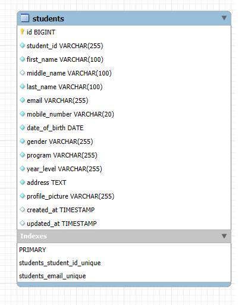

---

## 8. Registration Process Flowchart

The registration process starts when the user opens the registration page and fills out the required student information.

After the form is submitted, Laravel performs server-side validation. If the data is invalid, the user is returned to the registration page with validation errors and the previous input. The student can then correct the information and submit the form again.

If the data is valid, Laravel uploads the profile picture, stores the image path, saves the student information in MySQL, creates a flash success message, and redirects the user to the Student Profile Page.

### Registration Flowchart


---

## 9. Screenshots

### 9.1 Registration Form

The registration form collects the student's personal, contact, academic, and profile information.

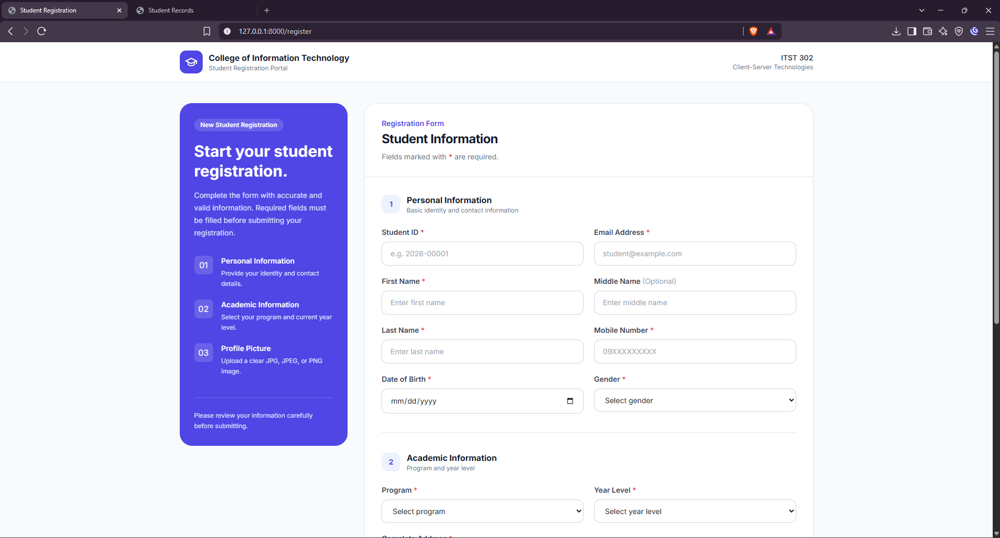

### 9.2 Validation Errors

Laravel displays validation error messages when required or invalid information is submitted.

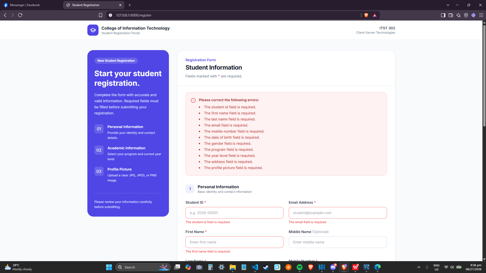

### 9.3 Successful Registration

The system successfully saves the student after the submitted data passes validation.

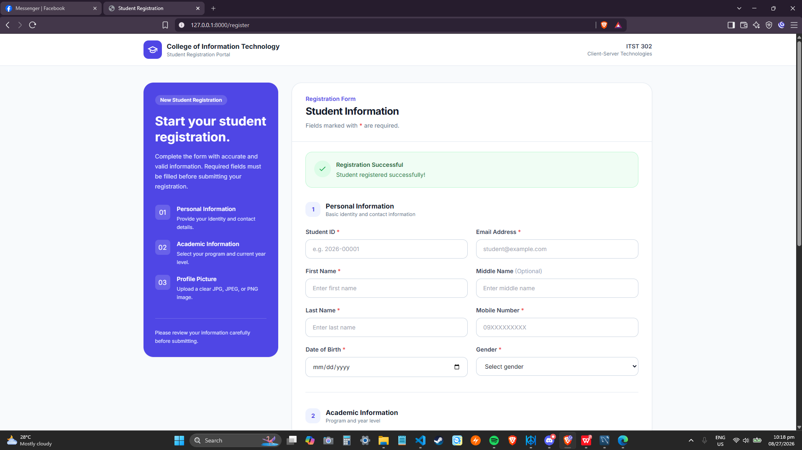

### 9.4 Flash Success Message

A success notification confirms that the student was registered successfully.


### 9.5 Uploaded Profile Picture

The uploaded profile picture is stored using Laravel Storage and displayed in the application.

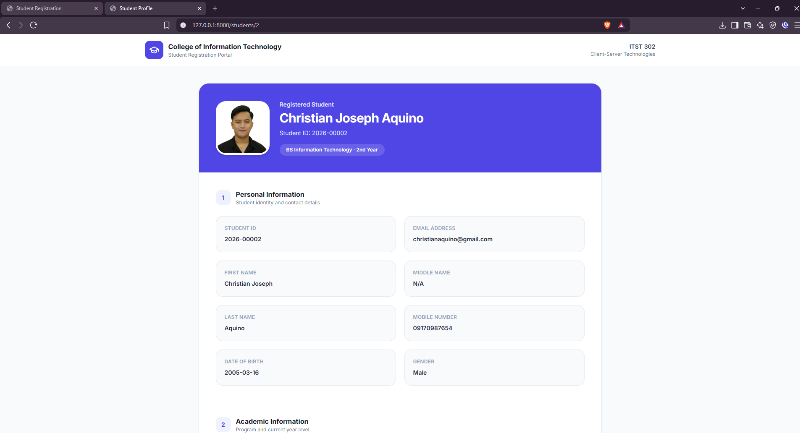

### 9.6 Database Records

Registered student information is stored in the MySQL `students` table.

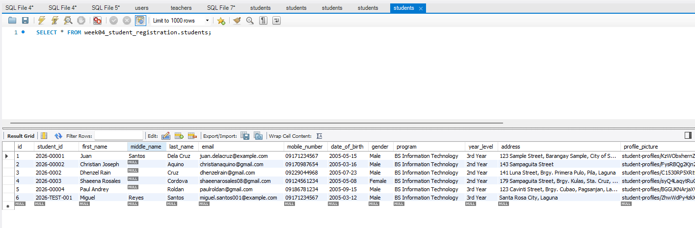

### 9.7 Student Profile Page

The Student Profile Page displays the registered student's information and uploaded profile picture.

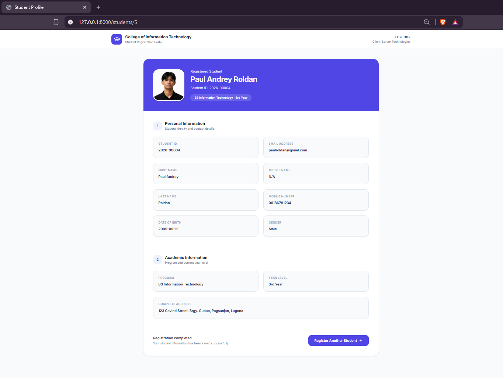

### 9.8 Visual Studio Code Project Structure

The application follows an organized Laravel project structure.

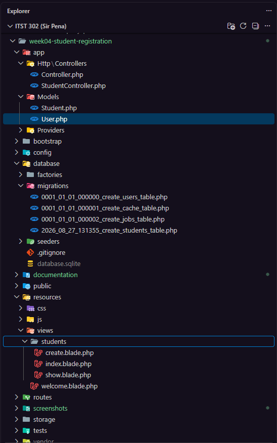

### 9.9 Terminal Output

The terminal output shows the Laravel migration status and confirms that the required migrations have been executed.

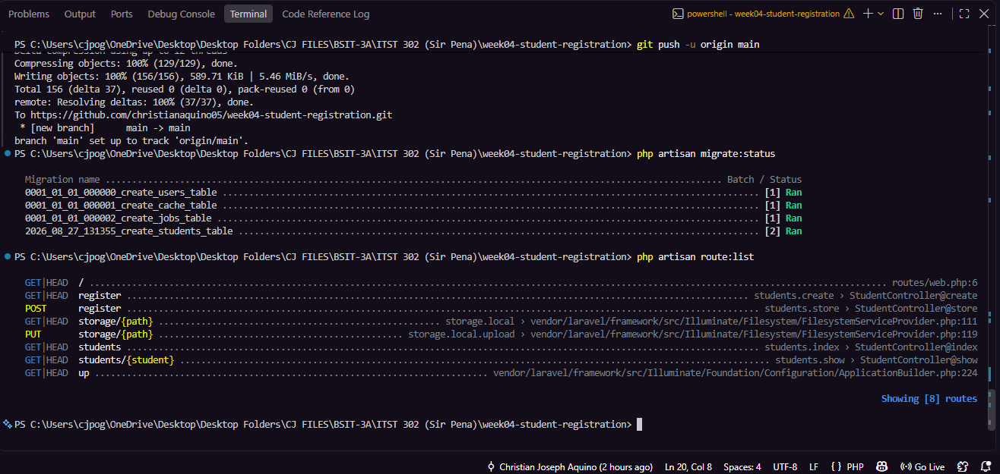

### 9.10 Browser Output

The browser output shows the working Student Records page with registered students retrieved from MySQL.

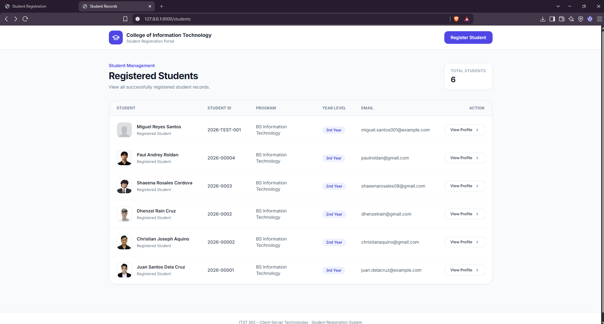

### 9.11 GitHub Repository

The completed Student Registration System is stored in a public GitHub repository together with its source code, documentation, diagrams, screenshots, and Git commit history.

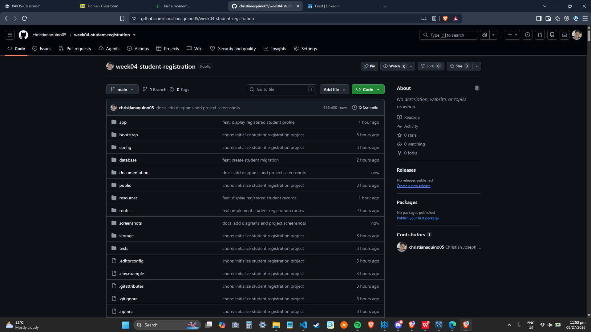

---

## 10. Problems Encountered

During development, several technical problems were encountered.

### Problem 1 – MySQL PDO Driver Error

When the Laravel migration was first executed, the application returned:

```text
could not find driver
```

Laravel could not connect to MySQL because the required PHP MySQL PDO driver was not initially available to the PHP command-line environment.

### Problem 2 – MySQL Access Denied

After the PDO driver issue was resolved, Laravel returned:

```text
Access denied for user 'root'@'localhost'
```

The MySQL password configured in the Laravel `.env` file contained an incorrect value.

### Problem 3 – Laravel Cache Table Did Not Exist

After the database credentials were corrected, running:

```bash
php artisan optimize:clear
```

returned an error because the `cache` table did not yet exist.

The Laravel project was configured to use the database for cache storage, but the default migrations had not yet been executed.

---

## 11. Solutions

### Solution 1 – Verify the MySQL PDO Driver

The active PHP configuration was checked using:

```bash
php --ini
```

The available PHP modules were then verified using:

```bash
php -m
```

The output confirmed the required MySQL-related modules:

```text
mysqlnd
PDO
pdo_mysql
pdo_sqlite
```

After `pdo_mysql` was available, Laravel was able to communicate with MySQL.

### Solution 2 – Correct the Database Credentials

The MySQL credentials in `.env` were reviewed and the incorrect database password was corrected.

The database configuration followed this structure:

```env
DB_CONNECTION=mysql
DB_HOST=127.0.0.1
DB_PORT=3306
DB_DATABASE=week04_student_registration
DB_USERNAME=root
DB_PASSWORD=YOUR_MYSQL_PASSWORD
```

After correcting the password, Laravel successfully connected to MySQL.

### Solution 3 – Run the Database Migrations

The missing cache table occurred because the database was still empty.

The migrations were executed using:

```bash
php artisan migrate
```

After Laravel created its required tables, the cache clearing command completed successfully:

```bash
php artisan optimize:clear
```

This showed the importance of completing database initialization before using Laravel features that depend on database-backed tables.

---

## 12. Reflection

Developing the Student Registration System helped me understand how Laravel processes data from a form until it is stored in the database and displayed back to the user. At first, the project looked simple because it only involved a registration form, but I learned that a working registration system needs more than just input fields. The application must validate the information, prevent duplicate records, handle uploaded files correctly, connect to the database, and return clear feedback to the user. This activity helped me see how these parts work together inside a Laravel application.

One of the most important lessons I learned was the importance of validation. Without validation, users could submit incomplete information, invalid email addresses, duplicate Student IDs, or incorrect file types. Laravel's server-side validation made it possible to check the submitted data before saving anything to MySQL. I also learned why server-side validation is more reliable than depending only on client-side validation. Client-side validation is useful because it can give faster feedback in the browser, but it can be bypassed. Server-side validation still checks the request inside the application, which makes it necessary for protecting the data that reaches the database.

The file upload feature also taught me an important lesson about handling user input. A profile picture should not be accepted without checking its type and size. In this project, the uploaded file is limited to supported image formats and a maximum size of 2 MB. The image is stored inside Laravel's public storage, while only the file path is saved in the students table. This approach keeps the database organized and allows the application to display the image later on the student profile page. Running the storage link command also helped me understand how Laravel makes files from storage accessible to the browser.

I also gained a clearer understanding of Laravel's request lifecycle. When the user submits the registration form, the browser sends a request to a route. The route sends the request to the StudentController, where validation and file handling take place. If the data is valid, the Student model creates a record in the MySQL database. Laravel then returns a response by redirecting the user to the student profile page and displaying a success flash message. If the validation fails, the user is returned to the form with error messages and the previous input.

The problems I encountered during setup also improved my troubleshooting skills. I experienced a missing MySQL PDO driver, an incorrect database password, and a missing cache table before the migrations were completed. Solving these issues showed me the importance of checking the PHP configuration, environment variables, and migration status step by step. Overall, this activity gave me practical experience in form processing, validation, file security, database integration, and Laravel MVC. These are important skills because registration systems are commonly used in schools, companies, hospitals, banks, government offices, and other enterprise applications where accurate and secure user information is required.

The project also showed me why clear documentation and meaningful Git commits are useful because they make the development process easier to review, explain, and maintain.

---

## 13. Installation and Setup

Follow these steps to run the project locally.

### Requirements

Make sure the following are installed:

- PHP
- Composer
- MySQL
- Git

### 1. Clone the Repository

```bash
git clone https://github.com/christianaquino05/week04-student-registration.git
```

Move into the project folder:

```bash
cd week04-student-registration
```

### 2. Install PHP Dependencies

```bash
composer install
```

### 3. Create the Environment File

Copy `.env.example` and create a new `.env` file.

Generate the Laravel application key:

```bash
php artisan key:generate
```

### 4. Configure MySQL

Create a database named:

```text
week04_student_registration
```

Update the database section of `.env`:

```env
DB_CONNECTION=mysql
DB_HOST=127.0.0.1
DB_PORT=3306
DB_DATABASE=week04_student_registration
DB_USERNAME=root
DB_PASSWORD=YOUR_MYSQL_PASSWORD
```

### 5. Run Database Migrations

```bash
php artisan migrate
```

### 6. Create the Storage Link

```bash
php artisan storage:link
```

This makes profile pictures stored in Laravel's public storage accessible to the browser.

### 7. Start Laravel

```bash
php artisan serve
```

Open:

```text
http://127.0.0.1:8000
```

### Main Routes

| Route | Purpose |
| --- | --- |
| `/` | Redirects to the registration form |
| `/register` | Student Registration Form |
| `/students` | Registered Student Records |
| `/students/{student}` | Individual Student Profile |

---

## 14. Project Structure

```text
week04-student-registration/
│
├── app/
│   ├── Http/
│   │   └── Controllers/
│   │       └── StudentController.php
│   └── Models/
│       └── Student.php
│
├── database/
│   └── migrations/
│       └── create_students_table.php
│
├── documentation/
│   ├── registration-flowchart.png
│   ├── student-registration-erd.png
│   └── laravel-request-lifecycle.png
│
├── resources/
│   └── views/
│       └── students/
│           ├── create.blade.php
│           ├── index.blade.php
│           └── show.blade.php
│
├── routes/
│   └── web.php
│
├── screenshots/
│   ├── 01-registration-form.png
│   ├── 02-validation-errors.png
│   ├── 03-successful-registration.png
│   ├── 04-flash-success-message.png
│   ├── 05-uploaded-profile-picture.png
│   ├── 06-database-records.png
│   ├── 07-student-profile-page.png
│   ├── 08-vscode-project-structure.png
│   ├── 09-terminal-output.png
│   └── 10-browser-output.png
│
├── storage/
└── README.md
```

---

## 15. Git Version Control

Git was used throughout the development process to maintain an organized history of meaningful changes.

The project includes commits such as:

```text
chore: initialize student registration project
feat: create student migration
feat: configure student model
feat: create student controller
feat: implement student registration routes
feat: build student registration form
feat: implement validation rules
feat: upload student profile picture and save registration
feat: add registration flash messages
feat: display registered student profile
feat: display registered student records
```

Additional documentation commits are used for diagrams, screenshots, and the README.

---

## 16. References

Laravel. (n.d.). *Laravel documentation*. https://laravel.com/docs

MDN Web Docs. (n.d.). *Web development resources*. Mozilla. https://developer.mozilla.org/

Oracle. (n.d.). *MySQL documentation*. https://dev.mysql.com/doc/

PHP Documentation Group. (n.d.). *PHP manual*. https://www.php.net/manual/

Tailwind Labs. (n.d.). *Tailwind CSS documentation*. https://tailwindcss.com/docs

---

## 17. Project Information

**Project:** Student Registration System  
**Course:** ITST 302 – Client-Server Technologies  
**Activity:** Week 4 Laboratory Activity – Mini Project 03  
**Framework:** Laravel  
**Database:** MySQL  
**Project Type:** Individual  
**Repository:** `week04-student-registration`

---

## Conclusion

The Student Registration System demonstrates the basic workflow of a data-driven Laravel application. It combines Blade forms, request handling, server-side validation, Eloquent models, MySQL database integration, Laravel Storage, file uploads, flash messages, and responsive user interfaces.

The project shows how submitted information can be validated before it is stored and then presented back to the user through a student profile and records page. It also demonstrates the importance of organized code, secure file handling, database design, documentation, and version control when developing web applications.
